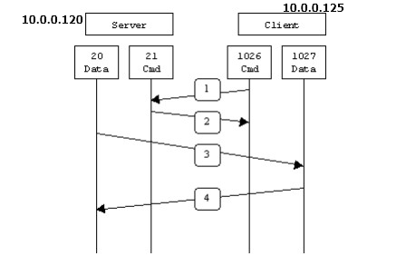
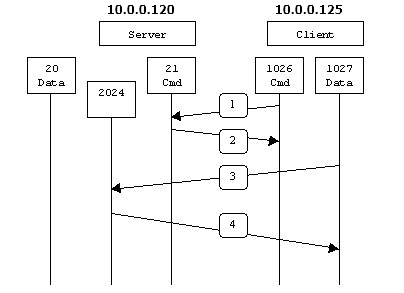

# miniftp
一个用 **cpp** 写的简易的 **ftp** 服务器.

# 背景知识

下面的描述大部分来自[http://www.cnblogs.com/xiaohh/p/4789813.html](http://www.cnblogs.com/xiaohh/p/4789813.html),但是做了些许的修改和补充.

FTP协议其实是非常简单的一个协议.

FTP与其他协议有所不同的地方在于,它使用了两条 **TCP** 连接,一条连接用于FTP协议的命令传递,可以称之为命令连接,FTP服务端一般选择 **21** 号端口作为自己的命令端口,另外一条连接用于FTP协议的数据传递,可以称之为为数据连接.服务端一般选择 **20** 号端口作为自己的数据端口.

为了应对不同的网络环境, FTP协议设计了两种不同的数据连接模式,一种是主动模式,另外一种是被动模式 .

## 主动模式FTP

主动模式下，FTP客户端从本主机任意非特殊的端口 **N**  (一般大于 **1023** )通过 **TCP** 连入到FTP服务器的命令端口(一般为 **21** 端口)。然后客户端在 **N+1** 端口监听，并且通过命令连接向服务端发送 **PORT** 命令, 告知服务端如果要将数据传递给客户端或者试图从客户端获取数据的话,应该主动连接到服务端 **N+1** 端口上。

以服务器端防火墙为立足点，一般来说, 要支持主动模式 FTP需要打开如下交互中使用到的端口：

- FTP服务器命令（21）端口接受客户端任意端口（客户端初始连接）
- FTP服务器命令（21）端口到客户端端口（>1023）（服务器响应客户端命令）
- FTP服务器数据（20）端口到客户端端口（>1023）（服务器初始化数据连接到客户端数据端口）
- FTP服务器数据（20）端口接受客户端端口（>1023）（客户端发送 **ACK** 包到服务器的数据端口）

在第1步中，客户端的命令端口与FTP服务器的命令端口建立连接，并发送命令 `PORT 10,0,0,125,4,3` 。这里需要注意一下的是,端口一般用一个16位的无符号整数表示,1027的高8位(1027 >> 8)为4,而低8位(1027 & 0xff)恰好为3.

然后在第2步中，FTP服务器给客户端的命令端口返回一个 `200 xxx` 的回复,表示已经服务端已经知晓。

在第3步中，FTP服务器发起一个从它自己的数据端口（20）到客户端先前指定的数据端口（1027）的连接，最后客户端的 **TCP** 协议在第4步中给服务器端返回一个ACK, 表示连接已经成功建立 。

主动方式FTP的主要问题实际上在于客户端。FTP的客户端并没有实际建立一个到服务器数据端口的连接，它只是简单的告诉服务器自己监听的端口号，服务器再回来连接客户端这个指定的端口。对于客户端的防火墙来说，这是从外部系统建立到内部客户端的连接，这是通常会被阻塞的。

## 被动模式的FTP

为了解决服务器发起到客户的连接的问题，人们开发了一种不同的FTP连接方式。这就是所谓的被动方式，或者叫做 **PASV** ，当客户端通知服务器它处于被动模式时才启用。

在被动方式FTP中，命令连接和数据连接都由客户端发起，这样就可以解决从服务器到客户端的数据端口的入方向连接被防火墙过滤掉的问题。当开启一个FTP连接时，客户端打开两个任意的非特权本地端口 **N** 和 **N+1** 。第一个端口连接服务器的命令端口(一般是 **21** ,但是服务端可以更改这个端口号)，但与主动方式的FTP不同的是，客户端不会发送 **PORT** 命令并允许服务器来回连它的数据端口，而是会提交 **PASV** 命令。这样做的结果是服务器会开启一个任意的非特权端口 **P**，并发送 **PORT IP P** 命令给客户端。然后客户端发起从本地端口 **N+1** 到服务器的端口 **P** 的 **TCP** 连接用来传送数据。

对于服务器端的防火墙来说，必须允许下面的通讯才能支持被动方式的FTP :

- FTP服务器命令端口接受客户端任意端口（客户端初始连接）
- FTP服务器命令端口到客户端端口（服务器响应客户端命令）
- FTP服务器数据端口接受客户端端口（客户端初始化数据连接到服务器指定的任意端口）
- FTP服务器数据端口到客户端端口（服务器发送ACK响应和数据到客户端的数据端口）

在第1步中，客户端的命令端口与服务器的命令端口建立连接，并发送命令 `PASV` 。然后在第2步中，服务器一般会返回该命令的一个回复 `227 xxx(10,0,0,120,7,232)` , 并且在 **2024** 端口启动监听 。在第3步中，客户端初始化一个从自己的数据端口 **1027** 到服务器端指定的数据端口 **2024** 的数据连接。最后服务器的 **TCP** 连接在第4 步中给客户端的数据端口返回一个 **ACK** 响应。

被动方式的FTP解决了客户端的许多问题，但同时给服务器端带来了更多的问题。最大的问题是需要允许从任意远程终端到服务器高位端口的连接。幸运的是，许多FTP守护程序，包括流行的WU-FTPD允许管理员指定FTP服务器使用的端口范围。详细内容参看附录1。 

第二个问题是客户端有的支持被动模式，有的不支持被动模式，必须考虑如何能支持这些客户端，以及为他们提供解决办法。例如，Solaris提供的FTP命令行工具就不支持被动模式，需要第三方的FTP客户端，比如ncftp。

随着WWW的广泛流行，许多人习惯用web浏览器作为FTP客户端。大多数浏览器只在访问ftp://这样的URL时才支持被动模式。这到底是好还是坏取决于服务器和防火墙的配置.

## 代码的说明

整体的代码并不是非常复杂,尽管如此,这里还是要稍微介绍一下代码的流程,给以后自己回顾代码提供方便.

主函数定义在`miniftp.cpp`这个文件中,主函数不干别的事情,只是监听而已.

一旦成功接收到客户端的连接,立马fork出一个子进程来处理连接.父进程继续监听.

子进程因为要处理两个命令连接和数据连接,继续fork出一个子进程,暂且称之为孙进程吧.子进程处理命令连接,孙进程处理数据连接,子孙两个进程之间通过pipe这种IPC方式进行通信.

孙进程所处的数据连接部分在这份代码中其实只是一个空壳而已,更准确的说,是一个代理.因为孙进程实际上只负责建立服务端和客户端之间的数据连接,但是它不负责传递数据,建立连接之后,一旦有数据要传递,它立即通过文件描述符传递的方式将连接传递给子进程来处理,你可能会问,为什么要这么干,其实,就是为了图方便而已.FTP在操控的时候经常会变动所处的目录,为了维护子进程和孙进程工作目录的同步是一件挺麻烦的事情.

当然,我一开始可能就错了,当初干脆将孙进程设计成为一个线程,应该会快速,方便得多,当然,这一切都是后话啦,我估计也没有太多时间继续在FTP协议上厮混了.

然后,所有的命令处理都由子进程来处理,FTP的命令处理其实是很简单的一件事情,这里也就不多重复了.

可能比较有意思的点是断点续传和限速.

这种东西说透了就一文不值了,所谓的断点续传就是,对方发送过来当初已经传递的文件的一个偏移,然后我们继续在偏移的这个位置上继续发送,限速就是单纯的计算而已,在一定时间内规定只能够发送这么多的数据,如果发送完了,时间还有剩余,等待一下即可.

